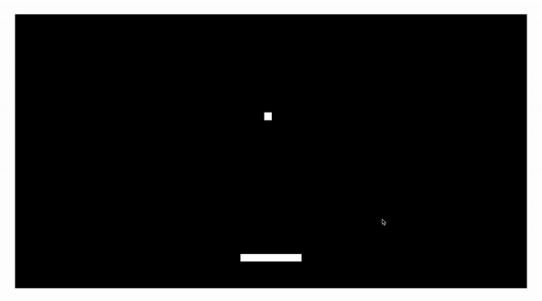
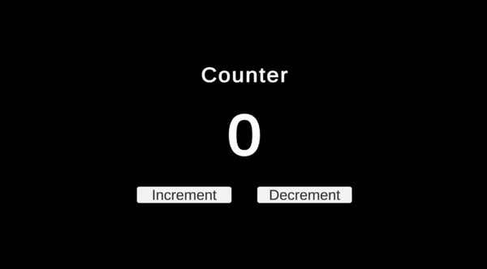
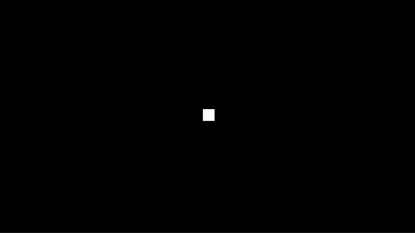

# Kata - Unity2D

A kata is an exercise in karate where you repeat a form many, many times, making little improvements in each. [CodeKata](http://codekata.com/)

Just like how a martial artist repeatedly practices kata, or how a musician repeatedly practices scales, a developer should repeatedly practice code kata for coding to improve.

This repository serves as a starting point for practicing code kata for 2D games in Unity.

To start a kata, create a new branch and start any one of the kata below. You may view previous kata attempts by checking out other existing branches.

Below are some katas that can be practiced within an hour.

1. [Pong](#pong)
1. [Counter](#counter)
1. [Command](#command)

## Pong

Great for practicing Unity's Rigidbodies and Colliders.

Requirements

- A Ball that can bounce around
- A Paddle that can be moved
- Boundaries to Restrict the ball and paddle's Movement

## Counter

Great for practicing UI and logic design patterns.

Requirements

- Text showing the count
- Increment count button
- Decrement count button

## Command

Great for practicing the [Command design pattern](https://learn.unity.com/tutorial/command-pattern).

Requirements

- Able to move up / down / left / right
- Able to undo any movement
